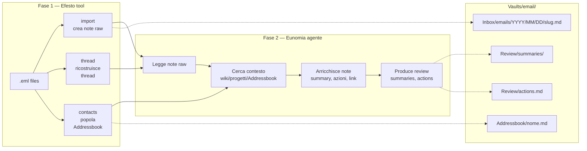
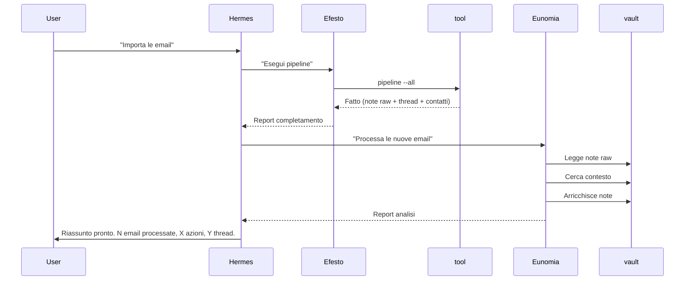

# Piano Implementazione — Pipeline Email Completa

> Data: 2026-05-19
> Stato: BOZZA — in attesa di approvazione

---

## Stato Corrente

| Componente | Stato | Note |
|---|---|---|
| `tools/email_processor/` v0.4.0 | ✅ Operativo | `import` funzionante, `process` stub, `status` stub |
| `tools/config.yaml` | ✅ Centralizzato | `email_dir: /mnt/hgfs/Emails/inbox`, `vault_root: vaults/email/` |
| `.opencode/agents/eunomia.md` | ❌ Da riscrivere | Attuale: catalogatrice. Obiettivo: analista contestuale |
| `vaults/email/` | ❌ Inesistente | Directory vuota. Va ricreata al primo import. |
| `/mnt/hgfs/Emails/inbox/` | 📦 2.070 .eml | 1.845 del 2026, 224 del 2025, 1 del 2024 |
| `Library/Meta/email-*.md` | ✅ Documentazione | 4 file: design, struttura, mapping, guida |

---

## Architettura Target



---

## Fase 1 — Efesto: modifiche al tool `email_processor`

### 1a — Salvare `references` nell'import

**File**: `tools/email_processor/cli.py`

**Cosa fare**: nella funzione `_parse_eml()`, aggiungere estrazione dell'header `References` e salvarlo nel frontmatter.

**Dettaglio**:
```python
# Dopo message_id = ...
references_raw = _decode_mime_header(msg.get("References", ""))
references = [ref.strip() for ref in references_raw.split() if ref.strip()]
```

**Frontmatter aggiunto**:
```yaml
references:
  - "<msg-id-1>"
  - "<msg-id-2>"
```

**Impatto**: minimo. ~5 righe in `_parse_eml()` + ~3 righe nella generazione frontmatter.

---

### 1b — Nuovo comando `thread`

**File**: `tools/email_processor/cli.py`

**Nuovo comando**:
```bash
uv run python -m tools.email_processor thread --rebuild
```

**Cosa fa**:
1. Scansiona ricorsivamente `vault_root / "Inbox" / "emails"` per tutti i `*.md`
2. Per ogni file, estrae `message_id` e `references` dal frontmatter
3. Costruisce grafo delle relazioni in memoria:
   - `parent_map: dict[message_id, message_id]` (ogni email → suo parent diretto)
   - `children_map: dict[message_id, list[message_id]]` (ogni email → lista figli)
   - `root_map: dict[message_id, message_id]` (ogni email → root del thread)
4. Per ogni file, aggiorna il frontmatter aggiungendo:
   ```yaml
   thread_parent: "<msg-id>"       # parent diretto (References[-1])
   thread_children:                 # figli diretti
     - "<msg-id>"
   thread_root: "<msg-id>"          # messaggio root del thread
   ```
5. Salva un file indice per ogni thread root in `Review/threads/<slug>.md`:
   ```markdown
   # Thread: Oggetto originale
   
   Cronologia:
   1. 2026-05-18 — Email A (da X) ← prima email
   2. 2026-05-18 — Email B (da Y) ← risposta
   3. 2026-05-19 — Email C (da X) ← risposta alla risposta
   
   Totale: 3 email, 2 partecipanti
   Stato: aperto (ultima risposta oggi)
   ```

**Specifica tecnica**:
- Algoritmo: References[-1] = parent diretto. References[0] = root thread.
- Se References vuoto → è un thread root.
- Se References ha un solo elemento → parent = references[0], root = references[0].
- Se References ha N elementi → parent = references[-1], root = references[0].
- I file indice di thread vanno in `Review/threads/<slug-root>.md`.
- Idempotente: ri-eseguire aggiorna solo frontmatter, non duplica.

**Funzioni da scrivere**:
- `_scan_all_notes(vault_root) -> list[dict]` — scansiona e restituisce message_id + references per ogni nota
- `_build_thread_graph(notes: list[dict]) -> tuple[dict, dict, dict]` — costruisce parent/children/root map
- `_update_note_frontmatter(note_path, parent, children, root)` — aggiorna frontmatter YAML preservando altri campi
- `_write_thread_index(root_id, thread_info, vault_root)` — scrive file indice in Review/threads/

**Sforzo**: ~150-200 righe di codice nuove.

---

### 1c — Aggiornare il comando `status`

Da stub a funzionante. Mostra:
- Totale note nel vault
- Di cui `status: new` / `processed` / `flagged`
- Quanti thread ricostruiti
- Quanti contatti in Addressbook
- Intervallo date (più vecchia → più recente)

### 1d — trigger di avvio per la pipeline

Un comando comodo:
```bash
uv run python -m tools.email_processor pipeline --all
```

Che esegue in sequenza: `import --all` → `thread --rebuild` → `contacts`
E alla fine scrive un file `.task` in `_review/queue/` per segnalare a Eunomia che ci sono email nuove da processare.

---

## Fase 2 — Eunomia v2: riscrittura agente

### Nuovo ruolo

**Da**: "catalogatrice digitale" — importa email, estrae contatti, scrive schede.
**A**: **"analista contestuale"** — legge email già importate, cerca contesto nel vault, arricchisce con riassunto e azioni.

### Cosa fa Eunomia v2

Per ogni email con `status: new` nel vault `vaults/email/`:

1. **Legge la nota** — frontmatter (mittente, data, thread) + body
2. **Segue il thread** — se `thread_parent` esiste, legge l'email precedente. Se `thread_children` esiste, legge le risposte successive. Ricostruisce la conversazione.
3. **Identifica il mittente** — cerca la scheda in `Addressbook/` per sapere chi è, organizzazione, storico.
4. **Cerca nel wiki** — `Library/Wiki/` — cerca concetti chiave dal subject e body per trovare pagine correlate.
5. **Cerca nei progetti** — `projects/` — verifica se l'email menziona progetti attivi (Tucson, paper Team Olimpo, xAI, LinkedIn, ecc.)
6. **Cerca nel vault principale** — `Library/` — per contesto tecnico o decisioni passate.
7. **Arricchisce la nota** con:
   ```markdown
   ## In breve
   [Riassunto 2-4 righe che spiega cosa c'è di nuovo,
   collegando a thread, progetti e wiki quando rilevante]
   
   ## Azioni / Decisioni
   - [ ] [Azione con contesto] (link a [progetto](...))
   - [x] [Decisione presa]
   
   ## Contesto
   - Thread: [Link email precedente] → [Link a questa] → [Link successiva]
   - Mittente: [Link Addressbook]
   - Progetti: [Link progetti correlati]
   - Wiki: [Link pagine wiki correlate]
   
   ---
   ## Thread completo
   [body raw originale preservato]
   ```
8. **Setta `status: processed`** nel frontmatter
9. **Se ci sono azioni**, le appende anche a `Review/actions.md`

### Profilo aggiornato

```yaml
# .opencode/agents/eunomia.md
description: >
  Analista contestuale per il vault email. Riceve email importate dal tool
  email_processor, segue i thread, cerca contesto nel wiki/progetti/Addressbook
  del Team Olimpo, e arricchisce le note con riassunto, azioni e link.
```

Le sezioni del profilo da riscrivere:
- **Chi sono** → Eunomia v2
- **Competenze** → ricerca contestuale, linking, sintesi
- **Processo operativo** → lo schema sopra (7 passi per email)
- **Limitazioni** → non importa email, non scrive codice, non modifica file fuori dal vault email

### Output di Eunomia

**Report a Hermes** al termine di ogni sessione:
```
## Report Eunomia — 2026-05-19
Email processate: 15
- Nuove: 12
- Thread ricostruiti: 4
- Azioni identificate: 7
- Link a progetti: 3 (Tucson, xAI, Paper)
- Contatti aggiornati: 2
File: Review/summaries/2026/05/19.md
Azioni aperte: Review/actions.md
```

---

## Fase 3 — Trigger e integrazione

### Come parte Eunomia

Tre opzioni. La migliore per ora è l'**opzione A**:

| # | Trigger | Meccanismo |
|---|---|---|
| **A** ✅ | **Manuale via Hermes** | Hermes: "Eunomia, processa tutte le email nuove" → Eunomia scansiona, processa, report. Semplice, diretto. |
| **B** | Batch da coda .task | Il tool scrive file JSON in `_review/queue/`. Eunomia li trova e li processa. Più automatizzato ma più complesso. |
| **C** | Watchdog autonomo | Eunomia si auto-attiva quando ci sono email con `status: new`. Difficile da implementare nel nostro stack (sessioni). |

**Decisione: A** — Hermes la attiva quando serve.

### Integrazione con Hermes

Flusso operativo tipico:



---

## Riferimenti Completi

### Path file coinvolti

| File | Scopo |
|---|---|
| `tools/email_processor/cli.py` | CLI principale — DA MODIFICARE: aggiungere references, comando thread |
| `tools/email_processor/__init__.py` | Versione tool (0.4.0 → 0.5.0) |
| `tools/email_processor/contacts.py` | Contatti Addressbook — NON TOCCARE |
| `tools/email_processor/attachment_cache.py` | Cache allegati — NON TOCCARE |
| `tools/config.yaml` | Config centralizzata |
| `.opencode/agents/eunomia.md` | Profilo Eunomia — DA RISCRIVERE |
| `vaults/email/` | Vault destinazione — DA CREARE |
| `/mnt/hgfs/Emails/inbox/` | Sorgente .eml — 2.070 file |
| `Library/Meta/email-processor-design.md` | Design doc esistente |
| `Library/Meta/email-vault-struttura.md` | Specifica struttura vault |
| `Library/Meta/email-vault-mapping.md` | Mapping vault email |
| `Library/Meta/email-processor-guida.md` | Guida rapida tool |

### Comandi

```bash
# Import
uv run python -m tools.email_processor import --limit 100
uv run python -m tools.email_processor import --all

# Thread (DA FARE)
uv run python -m tools.email_processor thread --rebuild

# Contatti
uv run python -m tools.email_processor contacts

# Pipeline completa
uv run python -m tools.email_processor pipeline --all

# Stato
uv run python -m tools.email_processor status
```

---

## Roadmap Implementazione

```
Step 0 — Ricreare vaults/email/
  mkdir -p vaults/email/Inbox/emails
  mkdir -p vaults/email/Addressbook
  mkdir -p vaults/email/Review/threads
  mkdir -p vaults/email/Review/summaries

Step 1 — Efesto: references in import
  Modificare _parse_eml() in cli.py
  Aggiungere references nel frontmatter
  Bump versione 0.4.0 → 0.5.0

Step 2 — Efesto: comando thread
  Scrivere _scan_all_notes()
  Scrivere _build_thread_graph()
  Scrivere _update_note_frontmatter()
  Scrivere _write_thread_index()
  Registrare comando thread in app Typer

Step 3 — Efesto: comando status
  Implementare statistiche vault
  Mostrare conteggi utili

Step 4 — Efesto: pipeline shortcut
  pipeline --all come sequenza

Step 5 — Eunomia: riscrittura profilo
  Riscrivere .opencode/agents/eunomia.md
  Nuovo processo: 7 passi
  Nuove competenze: analisi contestuale

Step 6 — Test ciclo completo
  import → thread → contacts → Eunomia
  Verificare arricchimento note
  Verificare Review/summaries e Review/actions
```
